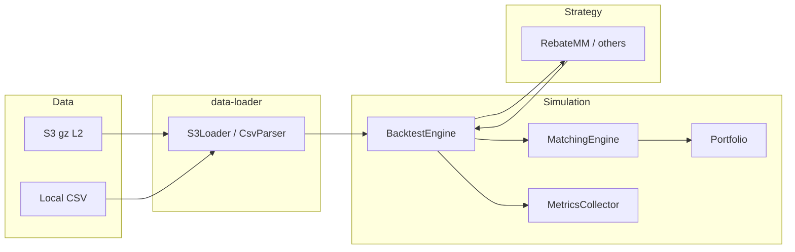

# Rust market making system — technical reference

Internal / engineer-facing documentation for the `mm` workspace. For a short overview aimed at recruiters or first-time visitors, see **[README.md](README.md)**.

---

# Rust market making system (`mm`)

A Rust workspace for **market-making research**: L2 order-book replay from **AWS S3** (or local CSV), a **simulated matcher** with configurable queue and latency behavior, **RebateMM** and related strategies, **metrics** (markouts, maker ratio, spread capture), and tooling to **mirror Crypto.com SFTP data into S3**. A **live paper** mode streams public Crypto.com websockets and runs the same strategy stack against the live book without sending orders.

This is not a single deployable “bot” binary: day-to-day use is `**cargo test` on `mm-engine`** for S3 backtests, plus `**mm-cli**` for data and paper trading.

---

## Features

- **S3 L2 backtests** — Stream gzipped snapshot files; optional date range (`S3_START_DATE` / `S3_END_DATE`), prefix narrowing, and `MAX_FILES` caps.
- **Matching engine** (`mm-simulator`) — Limit orders, layer-aware active book, queue-depletion and crossed-book fill paths; `QueueModelConfig` (touch queue fraction, cancel-ahead, churn, etc.).
- **RebateMM** (`rebate-mm`) — Primary strategy: spread/vol scaling, inventory skew, book imbalance, microprice impulse filters, phase-1 sizing buckets, kill switch, queue-aware touch join; driven by YAML merged with a shared harness.
- **Parameter sweeps** — Cartesian grid or named experiments over the same YAML surface; see [PARAMETER_SWEEP.md](PARAMETER_SWEEP.md).
- **Portfolio & fees** — Average-cost inventory, maker/taker bps via `SimpleFeeModel`.
- **Metrics** (`mm-metrics`) — Dashboard-style stats: fill rate, maker ratio, 1s/5s markout, adverse selection, rebate vs inventory drag, turnover, quote lifetime, etc.
- **Optional latency** — `LatencyModel` defers order activation and cancels (used in engine tests and live paper profiles).
- **CLI** (`mm-cli`) — `check-dates` (SFTP), `upload` (SFTP → S3), `live-paper` (websocket + paper fills).
- **Crypto.com client** (`crypto-com-api`) — WebSocket market stream (and REST/auth stubs) used by live paper.

---

## Requirements

- **Rust** — stable toolchain (`cargo`, `rustc`); workspace resolver `2` (see root `Cargo.toml`).
- **AWS** — For S3 backtests: credentials and region (e.g. `AWS_ACCESS_KEY_ID`, `AWS_SECRET_ACCESS_KEY`, `AWS_REGION` or default chain).
- **Optional** — Python 3 + venv for `scripts/visualize_backtest.py` (see [QUICK_START.md](QUICK_START.md)).
- **SFTP** — For `check-dates` / `upload`: Crypto.com data host access and SSH private key (see [DATA_GUIDE.md](DATA_GUIDE.md)).

---

## Repository layout

All paths below are under the `mm/` directory (workspace root).

```
mm/
├── Cargo.toml                 # workspace members
├── configs/                   # YAML: harness, RebateMM profiles, sweeps
├── crates/
│   ├── core/                  # mm-core-types — Order, Fill, Side, snapshots (no MM logic)
│   ├── mm-core/               # Strategy trait, market_data, portfolio view for strategies
│   ├── simulator/             # mm-simulator — MatchingEngine, QueueModelConfig
│   ├── portfolio/             # mm-portfolio — balances, avg cost, apply_fill
│   ├── metrics/               # mm-metrics — collector, markout, dashboard summary
│   ├── engine/                # mm-engine — BacktestEngine, fees, latency, round-trip tracking
│   ├── orderbook/             # L2 snapshot types / parsing helpers
│   ├── data-loader/           # CSV, multi-CSV, SFTP, S3 loaders
│   ├── backtest-engine/       # Older runner + integration tests (rebate-alpha, queue-farmer, etc.)
│   ├── strategies/
│   │   ├── balanced-mm/
│   │   ├── rebate-alpha/
│   │   ├── rebate-mm/         # main research strategy
│   │   └── queue-farmer{,-v2,-v3,-v4}/
│   ├── assets/
│   ├── crypto-com-api/
│   └── cli/                   # mm-cli binary
├── scripts/                   # shell helpers, visualize_backtest.py, aggregation
├── QUICK_START.md
├── DATA_GUIDE.md
├── PARAMETER_SWEEP.md
├── README.md                  # short overview (hiring / GitHub)
└── DETAILED_README.md         # this file
```

### Architecture (data flow)




---

## Build

```bash
cd mm
cargo build --release -p mm-cli          # CLI
cargo check --workspace                 # full workspace
```

Run tests that do **not** need S3:

```bash
cargo test -p mm-engine -- --skip backtest_s3
# or run only the local CSV engine test if data exists:
cargo test -p mm-engine test_engine_backtest -- --nocapture
```

---

## CLI (`mm-cli`)

Install/run:

```bash
cargo run --release -p mm-cli -- <subcommand> [options]
# or: ./target/release/mm-cli <subcommand>
```


| Command       | Purpose                                                                                                                                   |
| ------------- | ----------------------------------------------------------------------------------------------------------------------------------------- |
| `check-dates` | List which calendar dates exist on Crypto.com SFTP for a pair (optional year filter).                                                     |
| `upload`      | Download L2 gz files from SFTP for a date range and upload to S3 (concurrent SFTP + S3).                                                  |
| `live-paper`  | Subscribe to Crypto.com public book, run **RebateMM** with hardcoded builder chain + paper fill model; optional trade recording to jsonl. |


Common environment variables (see `crates/cli/src/main.rs` for defaults): `CRYPTO_COM_SFTP_USERNAME`, `CRYPTO_COM_SFTP_KEY_PATH`, `CRYPTO_COM_SFTP_REMOTE_PATH`, `S3_BUCKET`, `S3_PREFIX`, `AWS_REGION`, `TRADING_PAIR`, `MAX_CONCURRENT_UPLOADS`, `MAX_S3_CONCURRENT_UPLOADS`.

**Live paper example:**

```bash
cargo run --release -p mm-cli -- live-paper \
  --trading-pair ETH_USDT \
  --depth 50 \
  --latency-profile colo
```

Pair sizing/tick for live paper are read from `configs/` (see `live_paper.rs`).

---

## Backtesting (primary path: `mm-engine`)

The production-style backtest loop lives in `**crates/engine**` (`BacktestEngine`). **S3 runs are exposed as ignored async tests** so you can pass configuration via the environment without a separate `backtest` CLI subcommand.

### RebateMM on S3

```bash
cd mm
REBATE_MM_PROFILE=eth \
S3_BUCKET=your-bucket \
S3_PREFIX=2025/ \
TRADING_PAIR=ETH_USD \
AWS_REGION=us-east-1 \
MAX_FILES=2040 \
cargo test -p mm-engine backtest_s3_rebate_mm --release -- --ignored --nocapture
```

- **Profile / YAML** — `REBATE_MM_PROFILE=eth` or `btc` selects `configs/rebate_mm_eth.yaml` or `configs/rebate_mm_btc.yaml`. Override path with `SWEEP_CONFIG=configs/your_sweep.yaml` (must follow the sweep schema: `base`, optional `grid` / `experiments`).
- **Harness** — Fees, queue model, tick size, and initial capital default from `configs/backtest_engine_harness.yaml`. Override with `BACKTEST_ENGINE_HARNESS=/path/to.yaml`.
- **Which sweep row** — `REBATE_MM_SWEEP_RUN_INDEX` (default `0`). Use `REBATE_MM_BASE_ONLY=1` to ignore grid/experiments and use merged `base` only.
- **Crossed-book survival** — YAML `crossed_book_survival_rate` or env `CROSSED_BOOK_SURVIVAL_RATE`.

### Parameter sweep

```bash
SWEEP_CONFIG=configs/sweep_rebate_mm.yaml \
S3_BUCKET=... S3_PREFIX=... TRADING_PAIR=... \
cargo test -p mm-engine backtest_s3_sweep --release -- --ignored --nocapture
```

Details and parameter tables: [PARAMETER_SWEEP.md](PARAMETER_SWEEP.md). Optional output: `SWEEP_OUTPUT_CSV`.

### Other `mm-engine` S3 tests (all `#[ignore]`)


| Test                              | Notes                                                                                         |
| --------------------------------- | --------------------------------------------------------------------------------------------- |
| `backtest_s3_rebate_mm`           | Main RebateMM run; optional `BACKTEST_OUTPUT_CSV` → equity + `*_fills.csv` + `*_metrics.csv`. |
| `backtest_s3_sweep`               | Many runs over sweep YAML → `sweep_results.csv` (or `SWEEP_OUTPUT_CSV`).                      |
| `backtest_s3_queue_farmer` … `v5` | Queue-farmer strategy variants on S3.                                                         |
| `colo_sim_backtest`               | Colocation-oriented queue/latency assumptions.                                                |


### S3 / loader environment variables


| Variable                       | Role                                                                          |
| ------------------------------ | ----------------------------------------------------------------------------- |
| `S3_BUCKET`                    | Required for ignored S3 tests.                                                |
| `S3_PREFIX`                    | Key prefix; narrow to a month with e.g. `2025/01/`.                           |
| `TRADING_PAIR`                 | e.g. `ETH_USDT`, `BTC_USD`; filters `/cdc/{PAIR}/` in keys when set.          |
| `AWS_REGION`                   | S3 client region.                                                             |
| `MAX_FILES`                    | Cap listed objects after filters (omit for no cap).                           |
| `MAX_CONCURRENT_DOWNLOADS`     | Parallel downloads (loader).                                                  |
| `S3_START_DATE`, `S3_END_DATE` | Inclusive `YYYY-MM-DD` filter on date segments in keys (set both or neither). |
| `BACKTEST_OUTPUT_CSV`          | Base path for exported CSVs from RebateMM test.                               |


Typical object layout (see [QUICK_START.md](QUICK_START.md)):

`s3://bucket/prefix/YYYY/MM/DD/cdc/PAIR/*.gz`

---

## Configuration merge order (RebateMM + harness)

1. Load `configs/backtest_engine_harness.yaml` → `defaults` + `capital`.
2. Merge the active profile/sweep `**base**` map on top (profile wins on key conflicts).
3. For a sweep run, merge the selected grid cell or experiment row onto that.
4. Environment may still override specific simulator fields (e.g. crossed-book survival) as documented in test modules.

Strategy parameters are deserialized in `crates/engine/tests/common/rebate_mm_sweep_builder.rs` and must stay aligned with `rebate-mm`’s builder API.

---

## Legacy / alternate runner (`backtest-engine`)

The `**backtest-engine**` crate retains its own runner and tests (`backtest_s3_rebate_alpha`, `backtest_s3_queue_farmer`, `validate_s3_data`, etc.). New work and RebateMM sweeps target `**mm-engine**` first; use `backtest-engine` when you need those specific harnesses or historical comparisons.

---

## Scripts and visualization

- `scripts/visualize_backtest.py` — HTML report from `BACKTEST_OUTPUT_CSV` equity file.
- `scripts/run_rebate_backtest.sh`, `run_balanced_mm_backtest.sh`, `run_rebate_alpha_backtest.sh` — Wrap `cargo test` with logging/aggregation (some target `backtest-engine` tests; read each script before use).
- `scripts/aggregate_*.sh`, `combine_monthly_backtests.py`, `analyze_markout_1s.py` — Post-processing.

See [QUICK_START.md](QUICK_START.md) for venv setup and chart generation.

---

## Crypto.com data pipeline

SFTP host, paths, and upload examples: **[DATA_GUIDE.md](DATA_GUIDE.md)**.

Upload shortcut (from repo root, after `cd mm`):

```bash
cargo run --release -p mm-cli -- upload \
  --s3-bucket YOUR_BUCKET \
  --s3-prefix 2025/ \
  --s3-region us-east-1 \
  --sftp-remote-path "/exchange/book_l2_150_0010/2025/1/1/cdc/BTC_USDT" \
  --start-date 2025-01-01 \
  --end-date 2025-01-31
```

Adjust `sftp-remote-path` so date iteration matches your SFTP layout (the CLI walks the requested calendar range).

---

## Further reading


| Doc                                      | Content                                                           |
| ---------------------------------------- | ----------------------------------------------------------------- |
| [RESULTS.md](RESULTS.md)                 | Consolidated 2025 monthly backtest results (ETH_USD, BTC_USD)     |
| [QUICK_START.md](QUICK_START.md)         | S3 buckets reference, backtest one-liners, CSV export, Plotly viz |
| [DATA_GUIDE.md](DATA_GUIDE.md)           | SFTP, S3 upload, env vars for data                                |
| [PARAMETER_SWEEP.md](PARAMETER_SWEEP.md) | Sweep YAML format and RebateMM parameters                         |
| `../scaling.md` (repo root)              | Scaling / layer notes (if present in your checkout)               |


---

## License

MIT